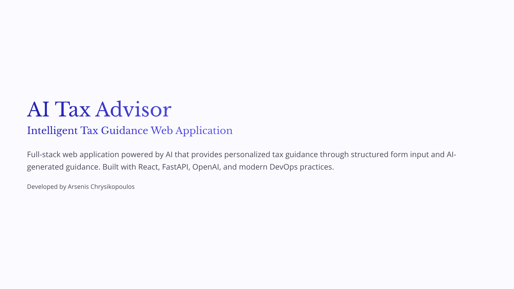

# AI Tax Advisor

AI-powered web application that provides intelligent, personalized tax guidance through a modern full-stack architecture and integrated AI services.

The app collects basic tax information (income, expenses, filing status,
dependents) via a responsive UI.

**AI in the app:** after you submit the form, the **FastAPI** service builds a
structured prompt, calls the **OpenAI** API (Responses) server-side, and returns
the model text in `message`. The **React** client renders that text as
**Markdown** (GFM) in the summary, with sanitization. No API key ever ships to
the browser; configure the backend with `APP_OPENAI_API_KEY` (and optional
`APP_OPENAI_MODEL`). See `backend/.env.example`.

## Presentation

Application presentation (PDF): [](assets/AI-Tax-Advisor.pdf)

## Tech Stack

**Frontend**

- React 19 + TypeScript — UI + static types
- Vite — build tool & dev server
- React Router v7 — SPA routing
- React Hook Form + Zod — forms & validation
- `react-markdown` + `remark-gfm` + `rehype-sanitize` — AI reply as safe Markdown
- CSS Modules — scoped styles, dark mode, responsive

**Backend**

- FastAPI — REST API
- Pydantic v2 — request/response schemas + validation
- OpenAI Python SDK — `POST` flow calls the model from `app/integrations/`
- `asgi-correlation-id` + `structlog` — request tracing + structured logs
- Pytest — API tests

**Tooling & Infrastructure**

- `npm` (frontend) · `uv` (backend) — package managers

---

## Repository Structure

```
ai_tax_advisor/
├── .github/
│   └── workflows/
│       └── ci.yml               # GitHub Actions CI pipeline
├── frontend/                  # React + Vite + TypeScript client
│   ├── public/                # Static assets
│   ├── src/
│   │   ├── components/
│   │   │   └── layout/        # Header, Footer, Layout wrapper
│   │   ├── features/          # Feature-based modules
│   │   │   ├── home/          # Home page
│   │   │   └── tax-form/      # Tax input form + schema + summary
│   │   ├── lib/               # Utility helpers (formatters)
│   │   ├── routes/            # Router + NotFound page
│   │   ├── styles/            # Global CSS vars, reset, utilities
│   │   └── main.tsx
│   ├── index.html
│   ├── vite.config.ts         # Includes '@/*' path alias
│   └── package.json
├── backend/                   # FastAPI backend
│   ├── app/
│   │   ├── api/               # Routers (health, tax)
│   │   ├── core/              # Settings + logging
│   │   ├── integrations/      # e.g. OpenAI client
│   │   ├── schemas/           # Pydantic DTOs
│   │   └── services/          # Tax advice + prompt templates
│   ├── tests/                 # Integration tests
│   └── pyproject.toml
├── docker-compose.yml         # Local multi-container orchestration
├── .gitignore
└── README.md                  # ← you are here
```

**Path alias:** `@/...` resolves to `frontend/src/...` (configured in both
`vite.config.ts` and `tsconfig.app.json`).

---

## Prerequisites

- **Node.js ≥ 20** (tested with v24) — recommended via `[nvm](https://github.com/nvm-sh/nvm)`
- **npm ≥ 10** (bundled with Node.js)
- **Python ≥ 3.13** — recommended via `[pyenv](https://github.com/pyenv/pyenv)`
- **uv** — `curl -LsSf https://astral.sh/uv/install.sh | sh`
- **Docker Engine + Docker Compose** — required for containerized local run

Verify your setup:

```bash
node --version
npm --version
python3 --version
uv --version
docker --version
docker compose version
```

---

## Getting Started

### Frontend

```bash
cd frontend
npm install
npm run dev
```

The app will be available at **[http://localhost:5173](http://localhost:5173)**.

### Backend

```bash
cd backend
cp .env.example .env   # set APP_OPENAI_API_KEY (and model if you like)
uv sync --all-groups
uv run fastapi dev app/main.py
```

API docs (Swagger): **[http://localhost:8000/docs](http://localhost:8000/docs)**

Without a valid OpenAI key, tax advice calls will return **502** from `/api/tax/advice` because the app calls the real API.

---

## Run with Docker

The repository includes Docker setup for both services:

- `backend/Dockerfile` (FastAPI on port `8000`)
- `frontend/Dockerfile` (Vite dev server on port `5173`)
- `docker-compose.yml` (orchestrates frontend + backend)

### 1) Prepare backend env file

`docker-compose.yml` loads backend environment variables from `backend/.env`.

```bash
cd backend
cp .env.example .env   # set APP_OPENAI_API_KEY (and optional APP_OPENAI_MODEL)
cd ..
```

### 2) Build images

From the repository root:

```bash
docker compose build
```

### 3) Start containers

```bash
docker compose up
```

Or run in detached mode:

```bash
docker compose up -d
```

Services:

- Frontend: **[http://localhost:5173](http://localhost:5173)**
- Backend API: **[http://localhost:8000](http://localhost:8000)**
- Swagger docs: **[http://localhost:8000/docs](http://localhost:8000/docs)**

### Useful Docker commands

```bash
docker compose logs -f
docker compose logs -f backend
docker compose logs -f frontend
docker compose down
```

To rebuild after changes:

```bash
docker compose up --build
```

---

## CI/CD Pipeline (GitHub Actions)

Continuous Integration is configured in `.github/workflows/ci.yml`. The deploy job is currently a placeholder and does not perform a production deployment.

### When it runs

- On every `push` to `main`
- On every `pull_request` targeting `main`

### Pipeline jobs

1. `frontend`
  - Runs in `frontend/`
  - Uses Node.js `24`
  - Executes:
    - `npm ci`
    - `npm run lint`
    - `npm run build`
2. `backend`
  - Runs in `backend/`
  - Uses Python `3.13` + `uv`
  - Sets CI env values:
    - `APP_OPENAI_API_KEY=test-key`
    - `APP_APP_ENV=test`
  - `APP_OPENAI_API_KEY` is a dummy CI value used to satisfy settings validation during tests
  - Executes:
    - `uv sync --all-groups`
    - `uv run ruff check .`
    - `uv run mypy app tests`
    - `uv run pytest -v`
3. `docker`
  - Runs only if `frontend` and `backend` jobs pass
  - Validates container builds with:
    - `docker compose build`
4. `deploy`
  - Runs only if `docker` passes
  - Runs only for `push` events on `main`
  - Currently a placeholder step (`echo ...`) until a production target is configured

### CI flow summary

- Code pushed or PR opened to `main`
- Frontend and backend quality checks run
- If checks pass, Docker images are built
- If Docker build passes and event is `push` on `main`, a deploy placeholder job is triggered

You can inspect run history and logs in the repository's **Actions** tab on GitHub.

---

## Available Scripts

### Frontend (`cd frontend`)


| Command           | Description                                               |
| ----------------- | --------------------------------------------------------- |
| `npm run dev`     | Dev server with hot-module reloading                      |
| `npm run build`   | Type-check (`tsc -b`) + optimized production build (Vite) |
| `npm run preview` | Preview the production build locally                      |
| `npm run lint`    | Run ESLint across the codebase                            |


### Backend (`cd backend`)


| Command                          | Description              |
| -------------------------------- | ------------------------ |
| `uv run fastapi dev app/main.py` | Start FastAPI dev server |
| `uv run pytest -v`               | Run test suite           |
| `uv run ruff check .`            | Run lint checks          |
| `uv run mypy app tests`          | Run static type checks   |


---

## API Endpoints

Base URL (local): `http://localhost:8000`

### Health

- `GET /health` → liveness probe
- `GET /ready` → readiness probe

Example responses:

```json
{ "status": "ok" }
```

```json
{ "status": "ready" }
```

### Tax Advice

- `POST /api/tax/advice`
- Accepts camelCase payload from the frontend, validates, then calls OpenAI; 
- Returns the model’s guidance in `message` (or 502 if the AI call fails)

Request body:

```json
{
  "fullName": "Maria Papadopoulou",
  "age": 42,
  "taxResidency": "GR",
  "maritalStatus": "single",
  "employmentCategory": "employee",
  "annualIncome": 45000,
  "deductibleExpenses": 8000,
  "dependentChildren": 1,
  "notes": "Optional notes"
}
```

Response body (shape; `message` is natural-language Markdown from the model):

```json
{
  "status": "received",
  "message": "## General guidance\n\n- …\n- …",
  "receivedAt": "2026-04-24T17:22:27.131748Z"
}
```

Notes:

- Backend fields are snake_case internally and exposed as camelCase via Pydantic aliases.
- Empty/whitespace `notes` values are normalized to `null`.

## What's Implemented

### Features

- **Responsive layout** with sticky header, primary navigation, and footer with disclaimer
- **Home page** with hero, CTAs, and a features grid
- **Tax input form** with validated fields (identity, residency, employment, income, expenses, dependents, notes)
- **Client-side validation** with a shared Zod schema (errors inline with ARIA attributes)
- **AI tax guidance** on submit: the backend sends the user input to OpenAI API and receives a `message` stored in session
- **Personalized Advice** section with Markdown rendering
- **Submission preview** rendering the entered data and an estimated taxable base
- **404 Not Found** page for unknown routes

### Accessibility

- Semantic landmarks (`<header>`, `<main>`, `<footer>`, `<nav>`)
- Associated `<label>`, hint, and error messages for every input
- `aria-invalid`, `aria-describedby`, `role="alert"`, `aria-live="polite"` where appropriate
- Visible focus rings
- Automatic dark mode via `prefers-color-scheme`

### Responsive Design

- Mobile-first layout with breakpoints at 480 / 640 px
- Fluid typography using CSS `clamp()`
- Two-column form grid that collapses to a single column on narrow viewports

---

## License

This project is currently for educational/demonstration purposes.

> **Disclaimer:** AI Tax Advisor is a demonstration project and is not a
> substitute for professional tax advice. Always consult a certified
> accountant or tax professional for financial decisions.

